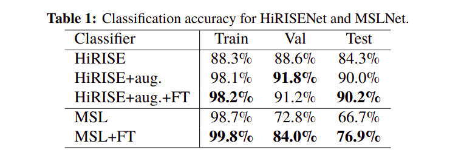
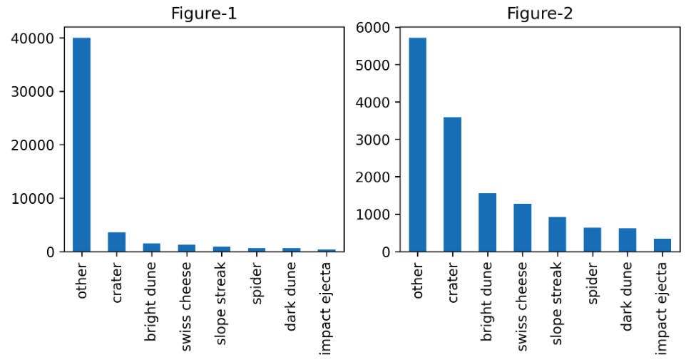
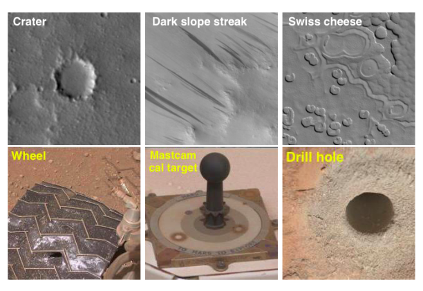
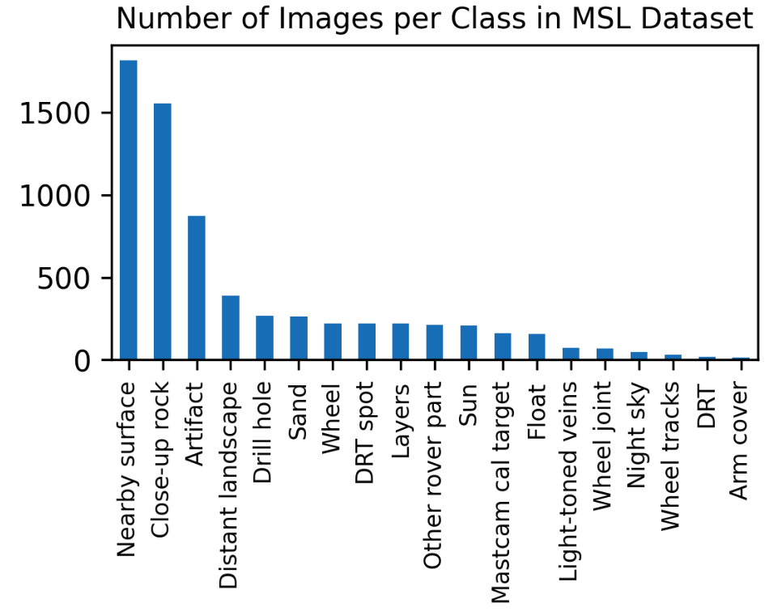

# MARS IMAGE CLASSIFICATION

# **Motivation**

This project is based on the work done by Lu et al in 2018 and 2019 which grew out of a **need to enable content analysis** to better find images of interest from the publicily accessible Planetary Data System (PDS) Imaging Node which hosts millions of images obtained from the planet Mars.

The images accquired by PDS contain descriptive information regarding the preprocessing and transfer to Earth but most often users need images based on content which could only be extracted through content analysis. They proposed a solution which involved a deep CNN and utilized transfer learning to adapt CaffeNet- a variant of AlexNet for use with Mars orbital and surface images.

**CaffeNet** is a replication of AlexNet with some differences: a) relighting augmentation not included in the training; b) the order of pooling and normalization layers is switched where in CaffeNet the pooling is done before normalization. The model was trained for 310,000 iterations on 1.2 million ImageNet images from 1000 classes. 

The authors **fine tuned CaffeNet and employed a classifier calibration** using temperature scaling which "does not change the predictions (or overall accuracy); instead it impacts accuracy at a given confidence cutoff" (they use a cutoff of 90%). They call these networks **HiRISENet and MSLNet**. 

They accuracies of the models can be found in the table below. "aug" stands for augmentation and "FT" stands for fine tuning. 

### **Why are we interested in this problem?**

1. The class distribution of the datasets is severely imbalanced and is prone to change over time with respect to not just an influx of data but also changing classes or labels with better understanding of the surface of Mars. Therefore handling the latest dataset (09.2020), different from the authors (01.2019), presented us with the opportunity to utilize the paper as a template while looking out for unexpected issues.

2. The dataset consists of images from Mars that SOTAs are not trained with; therefore we think it will be interesting to see how the popular models such as VGG, Inception, etc perform on this unique dataset. 

3. Given that the HiRISENet and MSLNet are not availabe on the internet, and nor is the architecture discussed in detail the paper, building our own model and getting a feel about how the model needs to be built to acheive the accuracies mentioned in the paper seems exciting and promising.

**Note:**

The dataset we used in our work is different from that of the authors in two ways: 

1. The dataset used for HiRISENet consists of 10,433 Mars landmark images cropped from 180 HiRISE map-projected images. This is then augmented to obtain a total of 73,031 landmark images covering eight classes. Our dataset consists of 64,947 landmark images including augmented ones (more details in the following section) sourced from 232 images.

2. The dataset used for MSLNet consists of 6,691 MSL images with labels that span over 24 classes while ours consists of 6,820 images spanning over 19 classes.

The HiRISE dataset that we have definetly isn't more balanced and representative as shown in Figure-1. And the MSL dataset has a large difference in the classes which could potentially influence any analysis that involves direct comaprison of models. Therefore, differences between the datasets used by the authors and by us needs to be studied further but this is beyond the scope of the project due to time constraints.

# **Learning Objectives**

1. Build a simple CNN for HiRISE data and address class imbalance.
2. Improve on the CNN to highlight the need for better neural networks for the problem at hand
3. Employ transfer learning using Mobilenet and Inception on HiRISE  data to evaluate performance and compare with our models.
4. Employ transfer learning with VGG and Inception on MSL dataset to see how it compares with the 2018 paper cited below.
5. Construct an autoencoder for filling incomplete images belonging to a selected class from the HiRISE dataset.

# **HiRISE** 

## **About**

HiRISE (High Resolution Imaging Science Experiment) is one of six instruments onboard the Mars Reconnaissance Orbiter. The orbiter was launched in 2005, arrived at Mars in 2006 and has been imaging ever since. The camera has a resolution capability of imaging up to 30 centimeters per pixel and is an important instrument for helping to select landing sites for robotic and future human exploration.

## **Dataset**

Created: 17.09.2020 

Accessed: 06.12.2020

URL: https://zenodo.org/record/4002935

Dataset contains a total of 64,947 landmark images detected and extracted from HiRISE browse images, spanning 232 separate source images. The dataset is split into 48,979 training images, 14,175 validation and 1793 test images.

**Data Augmentation**

It consists of 10,815 original landmarks. The creators of the dataset cropped each original landmark to a square bounding box that included the full extent of the landmark plus a 30-pixel margin to the left, right, top, and bottom. Each landmark was then resized to 227x227 pixels. Of these images, 9,022 of them were then augmented to generate 6 additional landmarks using the following methods:

1. 90 degrees clockwise rotation
2. 180 degrees clockwise rotation
3. 270 degrees clockwise rotation
4. Horizontal flip
5. Vertical flip
6. Random brightness adjustment

The remaining 1,793 images were not augmented. Combining these with the 
7 x 9022 images, gives a total of 64,947 separate images. This forms the HiRISE dataset that is used in our work sometimes in its entiretly and sometimes with changes we thought were much necessary. The data comes with train, validation and test sets. More details on this can be found in the EDA which follows after the Bibliography.   

**Classes**

The dataset consists of 8 classes:

0. other
1. crater
2. dark dune
3. slope streak
4. bright dune
5. impact ejecta
6. swiss cheese
7. spider

## **Discussion**

Use the above link for a detailed description of each class. What is important for us to know is that "*Other is a catch-all class that contains images that fit none of the defined classes of interest. This class makes up the majority of our data set.*" This will soon become very important as we begin our classification.

Below are two figures: Figure-1 is the count for all the classes in the training data and Figure-2 is the count for all the classes when the augmented data for class: "other" in not included. This bar graph shows the count only for the training data. 
What is very evident from these figures is that the data has high class imbalance and is the first issue that needs to be tackled before proceeding with any other classification based analysis.  

# **MSL**

## **About**

The Mars Science Laboratory (MSL) Mast Camera (Mastcam) system on NASA's Curiosity rover is a pair of fixed‐focal length, multispectral, color CCD imagers mounted ~2 m above the surface on the rover's remote sensing mast. It is tasked with characterizing the details of the history and processes recorded in geologic material at the MSL landing site within Gale crater via observations and documentation of atmospheric and meteorologic events and processes, landscape physiography, etc. 

The Mars Hand Lens Imager (MAHLI) on the other hand, employs a 2-megapixel color camera with a focusable macro lens aboard the rover to "investigate the stratigraphy and grain-scale texture, structure, mineralogy, and morphology of geologic materials in northwestern Gale crater."

## **Dataset**

Created: 16.09.2020

Accessed: 06.12.2020

URL: https://zenodo.org/record/4033453

The data set consists of 6,820 images that were collected by the Mars Science Laboratory (MSL) Curiosity Rover by three instruments: 

1. the Mast Camera (Mastcam) Left Eye; 
2. the Mast Camera Right Eye; 
3.  the Mars Hand Lens Imager (MAHLI). 

The dataset is split into training, validation, and test sets. The training set contains 5,920 images (including augmented); the validation set contains 300 images; the test set contains 600 images. These set were randomly sampled from sol (Martian day) range 1 - 948 for train; 949 - 1920 for validation; 1921 - 2224 for test set images.

All images are resized to 227 x 227 pixels without preserving the original height/width aspect ratio.

**Data Augmentation**

Only the training set contains augmented images. 3,920 of the 5,920 images in the training set are augmented versions of the remaining 2000 original training images. Images taken by different instruments were augmented differently. More information about the augmentation can be found in the link given above.

**Classes**

There are 19 classes with science and engineering interests in this dataset. 

The figure below taken from the paper Lu et al. shows the images from the HiRISENet (top) and MSLNet (bottom) datasets with their classes.

# **Summary of Results**

1. We built a simple 9 layered CNN with 25 million learnable parameters for HiRISE data and encountered a severe class imbalance. We approached the problem by removing augmented images from the majority class and appying class weights. Our test accuracy hit 80% but that is attributed again to the correct labelling of the majority class rather than the overall classes. 

2. We also used custom deeper layered CNN but with less learnable parameters and used custom preprocessor (PatchPreprocessor) as a train-time augmentation to help reduce overfitting and crop-preprocessor as a test-time augmentation to improve the accuracy. To implement all this we used our own custom made HDF5 Dataset Generator. We got 84% accuracy with deeper CNN and improved the accuracy to 85.72% using crop-preprocessor. Further, we used the ResNet50 as a feature extractor and trained Logistic Regression Classifier on the extracted features and we got the accuracy boost to 88%.

3. We employed transfer learning using MobileNet and Inception on HiRISE  data to evaluate performance of these models on our data. We found that Inception performed better than MobileNet when evaluating the test accuracy with 90.4% for the latter and 91.75% for the former. The authors report a test accuracy of 90.2% on their best model. But test accuracies can bemisleading or maybe one can say test accuracies don't reveal the exact anture of performace so such results must be taken with a grain of salt.

4. We initally wanted to apply transfer learning via the weights saved from our custom models onto MSL data given that the models were trained on Mars images and would possibly perform better with MSL data as compared to SOTA. But since we weren't able to get satisfactory results from the custom model on HiRISE data itself, we decided to drop the plan as it would be resources spent unwisely. 

5. Nevertheless we were curious to see how the perfromace of SOTAs such as VGG16 and Inception on MSL dataset. We achieved a test accuracy of 74% and 79%, on our data, for VGG16 and Inception respectively, while the authors report 76.9% for their fine tuned MSLNet. 

6. We constructed an autoencoder with the aim of reconstructing a fraction of an image. The performance was not as expected, but we believe that the model needs more training time and fine tuning to acheieve the results we're looking for. 

# **Our Learnings**

1. Class imbalances are a difficult topic. While several methods exist to tackle this imbalance, in our case, the data will grow with time, and handling this domain shift problem is a non trivial task and cannot be addressed with class balancing methods. Therefore, sometimes it is important to accept the data as is while finding better ways to interept the results and performance.

2. Working with real world data is a lot different than working with well structured data, it requires a lot of processing before training the model to get some good results.

3. Be very very very patient to get good results.

4. It's important to remember that with ML and AI: "Garbage In, Garbage Out".

# **Bibliography:**

Gary Doran, Emily Dunkel, Steven Lu, & Kiri Wagstaff. (2020). Mars orbital image (HiRISE) labeled data set version 3.2 (Version 3.2.0) [Data set]. Zenodo. http://doi.org/10.5281/zenodo.4002935

Steven Lu, & Kiri L. Wagstaff. (2020). MSL Curiosity Rover Images with Science and Engineering Classes (Version 2.1.0) [Data set]. Zenodo. http://doi.org/10.5281/zenodo.4033453

S. Lu, K. Wagstaff, J. Cai, G. Doran, K. Grimes, J. Lee, L. Mandrake,and Y Yue. Improved content-based image classifiers for the pds imageatlas.2019.

Kiri L. Wagstaff, You Lu, Alice Stanboli, Kevin Grimes, Thamme Gowda, and Jordan Padams. "Deep Mars: CNN Classification of Mars Imagery for the PDS Imaging Atlas." Proceedings of the Thirtieth Annual Conference on Innovative Applications of Artificial Intelligence, 2018.
